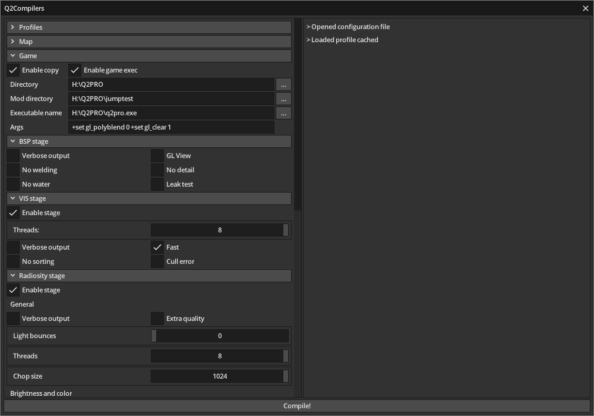
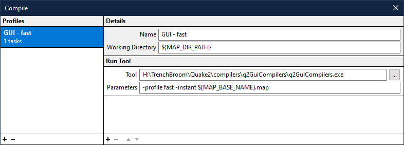

# q2GuiCompilers

This application is a graphical user interface version of the console tools for compiling Quake 2 map files. All the tools are included within the application which allows for effortless adjustments of the compilation process.



## Table of contents

- [Usage](#usage)
    * [Getting started](#getting-started)
    * [Command line arguments](#cl)
    * [Map editor integration](#integration)
        + [Trenchbroom](#trenchbroom)
        + [BSP editor](#bspe)
    * [Profiles](#profiles)
    * [Stages](#stages)
        + [Copy](#copy)
        + [Execute](#exec)
        + [BSP](#bsp)
        + [VIS](#vis)
        + [Radiosity](#radiosity)
- [Building](#building)
- [Notes](#notes)

## <a name="usage"></a> Usage

### <a name="getting-started"></a> Getting started

After downloading a [release](https://github.com/MaciejSzybiak/q2GuiCompilers/releases) and unzipping it the application is ready to use. First launch will create a configuration file and a cache profile in your local appdata folder.

Application's window is split into two panels. The left panel contains all the available settings and the right panel is where the console output appears.

Start by selecting the map you want to compile. Expand the **Map** panel and click the `...` button in order to browse for the file. The next mandatory step is to select you game directory (e.g. `C:\Quake2\`). You can do that in the **Game** panel. Other settings are optional and explained in detail [here](#stages).

### <a name="cl"></a> Command line arguments

The application can be launched using command line which is useful for various map editors. You can specify a few arguments when using that feature:
* `-profile <profile_name>` will load the selected [profile](#profiles) when the application starts
* `-instant` will automatically trigger compilation as soon as the application is launched
* last argument is always the path to a map file. It can be relative to the working directory or a full path to any file in your filesystem.

### <a name="integration"></a> Map editor integration

#### <a name="trenchbroom"></a> Trenchbroom

In order to use GUI with Trenchbroom open the Compile window and add a new profile with `${MAP_DIR_PATH}` set as the working directory. Add a `Run Tool` task to the profile and set the Tool path to GUI's executable. Last but not least you need to set parameters to `${MAP_BASE_NAME}.map`. If you want to add one of the [command line arguments](#cl) then make sure you put it before that string, as shown in the example below.



#### <a name="bspe"></a> BSP editor

Start by navigating to your BSP editor folder. Next go to `Quake2` folder, create a new folder named `q2GuiCompilers` and paste the contents of a release .zip inside it. From BSP editor folder navigate to `Quake2/Bats` and create a new .bat file with a name of your choice. Paste the following text into the file and save.

```bat
..\q2GuiCompilers\q2GuiCompilers.exe %1
pause
```

Now your .bat file should appear in the `Export` menu inside BSP editor. Additional [command line arguments](#cl) should be located between the path to the .exe and `%1`, as shown in the example below.

```bat
..\q2GuiCompilers\q2GuiCompilers.exe -profile fast -instant %1
pause
```

### <a name="profiles"></a> Profiles

Profiles are a convenient way of storing presets for various compilation scenarios. A profile stores all data that can be set from within the application, excluding path to the map file. Settings used during last application launch are stored in `cached` profile. This profile is loaded when application starts, unless the `-profile` [command line argument](#cl) is specified.

### <a name="stages"></a> Stages

#### <a name="copy"></a> Copy

This stage will copy the resultant .bsp file to `baseq2\maps` folder in the game directory or to the `maps` folder inside the mod directory if it's provided.

#### <a name="exec"></a> Execute

Execute is available only when copy is enabled. It will launch the specified Quake II executable, set the game to mod folder (if provided) and set the map to the resultant .bsp. You can specify additional execution arguments using *Args* text box in the **Game** panel.

#### <a name="bsp"></a> BSP

This stage is mandatory since it converts a .map file to .bsp file.

| Option | Description        |
|--------|--------------------|
| Verbose output | Outputs more information in the console. |
| GL View | Outputs a .gl file. I have no idea what's the purpose of it. |
| No welding | Stops vertex welding. Not recommended. |
| No detail | Removes all detail flags from brushes. |
| No water | Skips all water brushes. |
| Leak test | Aborts compilation if the map is leaked. |

#### <a name="vis"></a> VIS

Optional stage which calculates visibility for map nodes. If this stage is skipped then radiosity will run in direct lighting only mode.

| Option | Description        |
|--------|--------------------|
| Threads | The number of threads to use. 0 = auto |
| Verbose output | Outputs more information in the console. |
| Fast | Single pass, fast visibility calculation. Useful for test compilations. |
| No sorting | Don't sort portals. Slower when not using `fast` option. |
| Cull error | I don't know yet. |

#### <a name="radiosity"></a> Radiosity

This stage is based on [blarghrad](https://github.com/zzsort/blarghrad) which is en experimental lightmapper. It may cause some bugs or misbehaviours.

Radiosity is used to calculate lightmaps on the map. If VIS stage is skipped then no bouncing light is added.

| Option | Description        |
|--------|--------------------|
| Verbose output | Outputs more information in the console. |
| Extra quality | Creates additional light samples to improve light quality. Slows down the compilation process. |
| Light bounces | The amount of light bounces. 0 = auto |
| Threads | The number of threads to use. 0 = auto |
| Chop size | Maximum light patch size. Bigger value = slower compilation. Small values tend to trigger the MAX_PATCHES error. |
| Light brightness | Light brightness multiplier. |
| Surface light brightness | Surface light brightness multiplier. |
| Entity light brightness | Entity light brightness multiplier. |
| Texture brightness | Texture reflectivity multiplier. |
| Light saturation | Self-explanatory. |
| Global ambient amount | The amount of light added to the scene. |
| Light gamma | Self-explanatory. |
| Minimum lightstyles light | Minimum brightness for additional lightstyles. |
| Disable bmodel lighting | Self-explanatory. |
| Disable bounce fix | Disables improved bouncing algorithm. |
| Disable light face brightening | Disables applying its own light values to the emissive faces. |
| Disable bleeding correction | Disables anti-bleeding fix. |
| Disable phong shading | Disable smooth lighting of curved surfaces. |
| Disable anti-splotch fix | Self-explanatory. |
| Disable origin lighting | Self-explanatory. |
| Light warp surfaces | Add lightmaps to surfaces with `warp` flag. |
| Dump patch info | Save patch info to a file. |
| Stop PVS checking | Don't check PVS when making transfers. |


## <a name="building"></a> Building

Clone this repository using `git clone --recurse-submodules https://github.com/MaciejSzybiak/q2GuiCompilers.git` command. Use Visual Studio 2019 to open included solution file and build the program.

## <a name="notes"></a> Notes

Creating this application wouldn't be possible without using the following code:
* [microui](https://github.com/rxi/microui)
* [Glad](https://glad.dav1d.de/)
* [glfw](https://github.com/glfw/glfw)
* [Quake 2 compiling utilities](http://home.insightbb.com/~gryndehl/q2compile/quake2.html) made by Geoffrey DeWan
* [blarghrad](https://github.com/zzsort/blarghrad)
